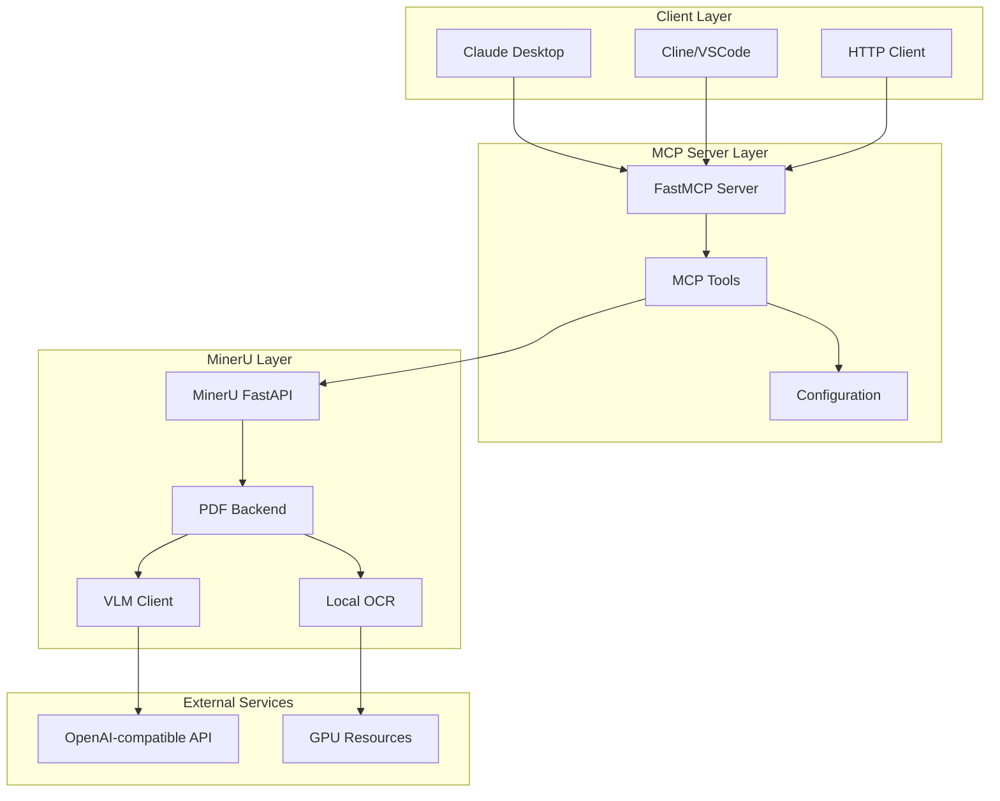
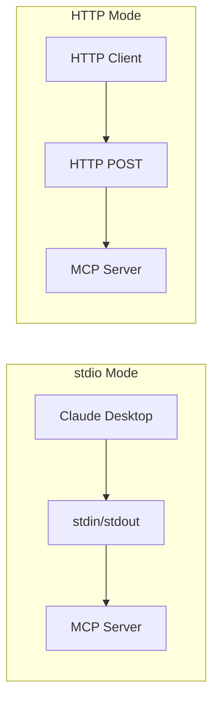
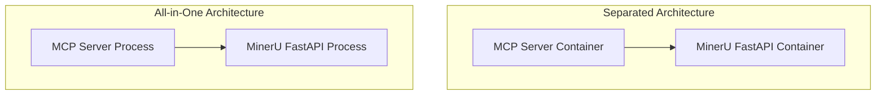

# MinerU MCP Server 架构审查报告

## 1. 执行摘要

本报告从架构师角度审视 MinerU MCP Server 的设计和实现，评估其架构决策、代码质量、安全性、可扩展性和可维护性。

**总体评价**: 设计合理，实现质量良好，符合 MCP 协议规范。存在若干可改进点，主要集中在错误处理、安全性和测试覆盖方面。

---

## 2. 系统架构概览

### 2.1 架构层次图



### 2.2 模块结构

| 模块 | 文件 | 职责 |
|------|------|------|
| 配置层 | [`config.py`](src/mineru/mcp/config.py:1) | 环境变量解析、配置管理 |
| 客户端层 | [`mineru_client.py`](src/mineru/mcp/mineru_client.py:1) | MinerU FastAPI HTTP 客户端 |
| 服务层 | [`server.py`](src/mineru/mcp/server.py:1) | FastMCP 服务器、工具定义 |
| CLI层 | [`cli.py`](src/mineru/mcp/cli.py:1) | 命令行入口点 |
| 容器层 | [`entrypoint.py`](src/mineru/mcp/entrypoint.py:1) | All-in-One 容器启动脚本 |

---

## 3. 设计决策评估

### 3.1 集成到 MinerU 包内 ✅ 正确决策

**决策**: 将 MCP Server 作为 `mineru.mcp` 子模块集成到 MinerU 包内，而非独立包。

**优点**:
- 减少依赖管理复杂度
- 复用 MinerU 现有依赖 (`httpx`, `loguru`, `click`, `fastapi`, `uvicorn`)
- 仅新增一个依赖 `mcp>=1.0.0`
- 统一版本管理和发布流程

**潜在风险**:
- MinerU 主包体积略微增加（约 20KB）
- MCP 功能与 MinerU 核心功能耦合

**评估**: ✅ 正确决策。对于工具型项目，集成式设计优于独立式设计。

### 3.2 双传输模式设计 ✅ 正确决策

**决策**: 支持 stdio 和 streamable-http 两种传输模式。



**优点**:
- stdio 模式适配桌面客户端（Claude Desktop、Cline）
- HTTP 模式适配远程调用和容器部署
- 符合 MCP 协议规范

**实现细节**:
```python
# server.py:43-47
mcp = FastMCP(
    config.server_name,
    stateless_http=True if config.is_http_mode() else False,
    json_response=True if config.is_http_mode() else False,
)
```

**评估**: ✅ 正确决策。`stateless_http=True` 和 `json_response=True` 是生产环境的推荐配置。

### 3.3 All-in-One 容器设计 ⚠️ 需要权衡

**决策**: 单容器内运行 MinerU FastAPI + MCP Server。

**优点**:
- 部署简单，单一镜像
- 内部通信无网络开销
- 适合边缘部署和个人使用

**缺点**:
- 违反单职责原则
- 资源竞争（两者共享 GPU/CPU）
- 扩展性受限（无法独立扩展 MinerU 或 MCP）
- 故障隔离差（一个崩溃可能影响另一个）

**替代方案**: 分离式架构



**评估**: ⚠️ 对于个人/小团队使用可接受。生产环境建议分离部署。

### 3.4 全局单例模式 ⚠️ 需要改进

**决策**: 使用全局变量存储配置、客户端和服务器实例。

```python
# config.py:54
_config: Optional[MCPConfig] = None

# mineru_client.py:308
_client: Optional[MinerUClient] = None

# server.py:372
_server: Optional[FastMCP] = None
```

**优点**:
- 简单易用
- 避免重复初始化

**缺点**:
- 隐式状态管理
- 测试困难（需要 `reset_*()` 函数）
- 多线程/多进程环境下可能有问题

**改进建议**: 使用依赖注入或上下文管理器

```python
# 推荐模式：依赖注入
class MCPApp:
    def __init__(self, config: MCPConfig):
        self.config = config
        self.client = MinerUClient(config.mineru_api_base)
        self.server = create_mcp_server(config, self.client)
```

---

## 4. 代码质量分析

### 4.1 类型标注 ✅ 良好

所有函数都有完整的类型标注：

```python
# mineru_client.py:65-77
async def parse_pdf_sync(
    self,
    file_path: str,
    backend: str = "hybrid-http-client",
    lang: str = "ch",
    formula_enable: bool = True,
    table_enable: bool = True,
    server_url: Optional[str] = None,
    return_md: bool = True,
    return_images: bool = False,
    start_page_id: int = 0,
    end_page_id: int = 99999,
) -> dict[str, Any]:
```

### 4.2 文档字符串 ✅ 良好

所有公开函数都有详细的文档字符串，符合 Google 风格：

```python
# server.py:65-90
"""Parse a PDF document and extract content.

This tool parses a PDF file using MinerU and returns the extracted
markdown content. For large files, consider using submit_task instead.

Args:
    file_path: Path to the PDF file to parse.
    backend: Parsing backend to use:
        - pipeline: Traditional pipeline (no VLM)
        - vlm-auto-engine: Local VLM engine
        ...
"""
```

### 4.3 错误处理 ⚠️ 需要改进

当前错误处理模式：

```python
# server.py:113-116
except FileNotFoundError as e:
    return {"status": "error", "error": str(e)}
except RuntimeError as e:
    return {"status": "error", "error": str(e)}
```

**问题**:
- 异常信息可能包含敏感路径信息
- 缺少结构化错误码
- 未区分客户端错误和服务端错误

**改进建议**:

```python
# 推荐模式：结构化错误
class MCPError:
    code: str  # "FILE_NOT_FOUND", "PARSE_FAILED", "TIMEOUT"
    message: str  # 用户友好消息
    details: Optional[dict]  # 详细信息（仅日志）

@mcp.tool()
async def parse_pdf(...):
    try:
        ...
    except FileNotFoundError:
        raise MCPError(code="FILE_NOT_FOUND", message="PDF file not found")
```

### 4.4 异步处理 ✅ 良好

正确使用 `asyncio` 和异步 HTTP 客户端：

```python
# mineru_client.py:288
await asyncio.sleep(poll_interval)  # 正确使用异步 sleep

# mineru_client.py:39-43
async def _get_client(self) -> httpx.AsyncClient:
    if self._client is None or self._client.is_closed:
        self._client = httpx.AsyncClient(timeout=self.timeout, follow_redirects=True)
    return self._client
```

---

## 5. 安全性分析

### 5.1 输入验证 ⚠️ 需要加强

**当前状态**: 仅验证文件存在性

```python
# mineru_client.py:96-97
if not file_path_obj.exists():
    raise FileNotFoundError(f"File not found: {file_path}")
```

**风险**:
- 路径遍历攻击（`../../../etc/passwd`）
- 符号链接攻击
- 文件类型验证不足

**改进建议**:

```python
def validate_file_path(file_path: str) -> Path:
    path = Path(file_path).resolve()
    
    # 1. 检查是否在允许的目录内
    allowed_dirs = [Path("/app/input"), Path.cwd()]
    if not any(path.is_relative_to(d) for d in allowed_dirs):
        raise ValueError("File path outside allowed directories")
    
    # 2. 检查文件类型
    if path.suffix.lower() != ".pdf":
        raise ValueError("Only PDF files are supported")
    
    # 3. 检查文件大小
    if path.stat().st_size > MAX_FILE_SIZE:
        raise ValueError("File too large")
    
    return path
```

### 5.2 认证机制 ⚠️ 未实现

**当前状态**: HTTP 模式无认证

```python
# config.py:26
http_auth_token: Optional[str]  # 定义了但未使用
```

**风险**: HTTP 模式下任何人都可以调用 MCP 工具

**改进建议**: 实现 Bearer Token 认证

```python
# 推荐实现
from mcp.server.auth import BearerAuthProvider

mcp = FastMCP(
    config.server_name,
    auth_provider=BearerAuthProvider(token=config.http_auth_token) if config.http_auth_token else None,
)
```

### 5.3 日志安全 ⚠️ 需要注意

**当前状态**: 日志可能包含敏感信息

```python
# mineru_client.py:118
logger.info(f"Uploading file: {file_path_obj.name}")  # 仅文件名，安全

# 但在其他地方可能有问题
logger.info(f"Starting MinerU FastAPI on {host}:{port}")  # 内部地址，可接受
```

**评估**: 当前日志安全，但需注意不要在日志中输出 API Key 或文件内容。

---

## 6. 可扩展性分析

### 6.1 并发处理 ✅ 良好

使用异步架构，支持并发请求：

```python
# 所有工具都是异步的
@mcp.tool()
async def parse_pdf(...):
    result = await client.parse_pdf_sync(...)
```

### 6.2 任务队列 ⚠️ 依赖 MinerU

MCP Server 本身无任务队列，依赖 MinerU FastAPI 的任务管理：

```python
# mineru_client.py:131-196
async def submit_task(...) -> str:  # 提交到 MinerU
async def get_task_status(task_id: str) -> dict[str, Any]:  # 查询 MinerU
```

**评估**: 合理设计，避免重复实现。

### 6.3 资源管理 ⚠️ HTTP 客户端复用

**已修复**: HTTP 客户端现在正确复用

```python
# mineru_client.py:37-49
self._client: Optional[httpx.AsyncClient] = None

async def _get_client(self) -> httpx.AsyncClient:
    if self._client is None or self._client.is_closed:
        self._client = httpx.AsyncClient(...)
    return self._client

async def close(self) -> None:
    if self._client is not None:
        await self._client.aclose()
```

---

## 7. 可维护性分析

### 7.1 代码组织 ✅ 良好

模块职责清晰，符合单一职责原则：

| 模块 | 职责 | 依赖 |
|------|------|------|
| `config.py` | 配置管理 | 无外部依赖 |
| `mineru_client.py` | HTTP 客户端 | `httpx`, `config` |
| `server.py` | MCP 服务 | `mcp`, `mineru_client`, `config` |
| `cli.py` | CLI 入口 | `click`, `server`, `config` |
| `entrypoint.py` | 容器启动 | `uvicorn`, `multiprocessing` |

### 7.2 测试覆盖 ❌ 缺失

**当前状态**: 无测试文件

**建议添加**:

```
src/mineru/mcp/tests/
├── test_config.py      # 配置解析测试
├── test_client.py      # HTTP 客户端测试（mock）
├── test_server.py      # MCP 工具测试
└── test_cli.py         # CLI 测试
```

### 7.3 配置管理 ✅ 良好

使用环境变量 + dataclass，符合 12-Factor App：

```python
# config.py:31-42
@classmethod
def from_env(cls) -> "MCPConfig":
    return cls(
        mineru_api_base=os.getenv("MINERU_API_BASE", "http://localhost:8000"),
        server_name=os.getenv("MCP_SERVER_NAME", "MinerU MCP Server"),
        ...
    )
```

---

## 8. 部署架构评估

### 8.1 Dockerfile 分析 ✅ 良好

```dockerfile
# mineru-mcp.Dockerfile
FROM opendatalab/mineru:latest  # 基于官方镜像
RUN pip install --no-cache-dir mcp>=1.0.0  # 仅添加 MCP SDK
EXPOSE 8000 8001  # 双端口
HEALTHCHECK --interval=30s ...  # 健康检查
```

**优点**:
- 基于官方镜像，减少维护成本
- 健康检查配置合理
- 环境变量默认值合理

### 8.2 Docker Compose 分析 ✅ 良好

```yaml
# mineru-mcp-compose.yml
services:
  mineru-mcp:
    ports: ["8000:8000", "8001:8001"]
    volumes: [./output:/app/output, ./input:/app/input:ro]
    healthcheck: ...
```

**优点**:
- 输入目录只读挂载（`:ro`）
- 健康检查配置
- 环境变量支持 `.env` 文件

**改进建议**: 添加资源限制

```yaml
deploy:
  resources:
    limits:
      memory: 8G
    reservations:
      devices:
        - driver: nvidia
          count: 1
          capabilities: [gpu]
```

---

## 9. MCP 协议合规性

### 9.1 工具定义 ✅ 符合规范

8 个 MCP 工具，覆盖完整功能：

| 工具 | 功能 | 类型 |
|------|------|------|
| `parse_pdf` | 同步解析 PDF | 同步 |
| `submit_task` | 提交异步任务 | 异步 |
| `get_task_status` | 查询任务状态 | 查询 |
| `get_task_result` | 获取任务结果 | 查询 |
| `extract_markdown` | 提取 Markdown | 便捷 |
| `get_images` | 获取图片 | 便捷 |
| `list_backends` | 列出后端 | 元数据 |
| `health_check` | 健康检查 | 元数据 |

### 9.2 Context 使用 ✅ 正确

正确使用 MCP Context 进行日志：

```python
# server.py:91-92
if ctx:
    await ctx.info(f"Parsing PDF: {file_path}")
```

### 9.3 工具描述 ✅ 详细

每个工具都有详细的描述和参数说明，符合 MCP 最佳实践。

---

## 10. 改进建议汇总

### 10.1 高优先级

| 问题 | 建议 | 影响 |
|------|------|------|
| 无测试覆盖 | 添加单元测试和集成测试 | 可维护性 |
| HTTP 无认证 | 实现 Bearer Token 认证 | 安全性 |
| 输入验证不足 | 添加路径遍历检查和文件类型验证 | 安全性 |

### 10.2 中优先级

| 问题 | 建议 | 影响 |
|------|------|------|
| 全局单例 | 改用依赖注入模式 | 可测试性 |
| 错误处理 | 结构化错误码 | 可维护性 |
| 资源限制 | Docker Compose 添加资源限制 | 稳定性 |

### 10.3 低优先级

| 问题 | 建议 | 影响 |
|------|------|------|
| All-in-One 容器 | 生产环境考虑分离部署 | 可扩展性 |
| 配置热更新 | 支持配置文件动态加载 | 运维便利 |

---

## 11. 架构演进路线图

### Phase 1: 当前状态（已完成）

- ✅ MCP Server 集成到 MinerU 包
- ✅ 双传输模式支持
- ✅ All-in-One 容器
- ✅ 8 个 MCP 工具

### Phase 2: 安全加固（建议）


- 添加文件路径验证
- 实现 Bearer Token 认证
- 结构化错误处理
- 添加测试覆盖

### Phase 3: 生产优化（可选）

- 分离式容器部署
- 添加 Prometheus 指标
- 实现请求限流
- 添加分布式追踪

---

## 12. 结论

MinerU MCP Server 的设计和实现总体上是合理的，符合 MCP 协议规范和 Python 最佳实践。主要优点包括：

1. **架构简洁**: 模块职责清晰，依赖管理合理
2. **协议合规**: 正确实现 MCP 工具和传输模式
3. **代码质量**: 类型标注完整，文档详细，异步处理正确

需要改进的方面主要集中在：

1. **安全性**: 输入验证、认证机制需要加强
2. **测试**: 缺少自动化测试
3. **错误处理**: 需要结构化错误码

建议按照优先级逐步改进，首先解决安全性和测试覆盖问题。

---

*审查日期: 2026-04-11*
*审查者: Architect Mode*