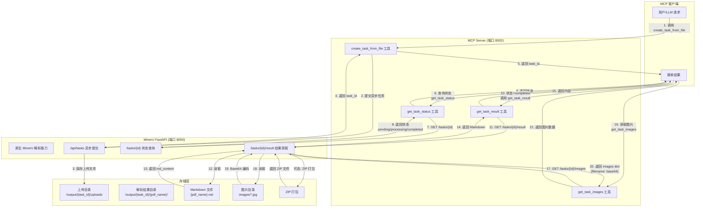

# MinerU MCP Server (Python)

一个基于 Python 的 Model Context Protocol (MCP) 服务器，与 MinerU 一体化部署在同一个容器中。

## 项目概述

本项目实现了一个 MCP 服务器，将 MinerU 的 PDF 解析能力通过 MCP 协议暴露给支持 MCP 的客户端（如 Claude Desktop、Cline 等）。

**核心优势**：
- **一体化部署**：MinerU + MCP 服务器在同一容器中，简化部署
- **零配置连接**：MCP 服务器直接调用本地 MinerU API，无需额外配置
- **两种运行模式**：支持 stdio（桌面客户端）和 HTTP（远程调用）模式

## 架构设计

```
┌─────────────────────────────────────────────────────────────┐
│                    All-in-One 容器                         │
│  ┌─────────────────────┐    ┌──────────────────────────┐   │
│  │   MinerU FastAPI    │    │    MCP Server (Python)   │   │
│  │   服务 (端口 8000)   │    │    stdio / HTTP 模式     │   │
│  │                     │    │                          │   │
│  │  - 原生 MinerU API  │    │  - create_task_from_file │   │
│  │  - 底层解析能力      │    │  - get_task_status      │   │
│  │  - 底层任务处理      │    │  - get_task_images      │   │
│  └─────────────────────┘    └──────────────────────────┘   │
│           同进程挂载 /api 与 /mcp（统一 Starlette 应用）      │
└─────────────────────────────────────────────────────────────┘
```

## 文档处理流程



### 流程说明

#### 异步模式（`/tasks`）

1. **提交任务**：调用 `create_task_from_file` 或 `POST /api/tasks`，返回 `task_id`
2. **轮询状态**：使用 `get_task_status` 查询处理进度
3. **获取结果**：状态变为 `completed` 后，调用 `get_task_result` 或 `GET /tasks/{id}/result` 获取内容
4. **获取图片**：调用 `get_task_images` 获取提取的图片（Base64 格式）

#### 当前结果获取方式

- 状态接口：`GET /api/tasks/{id}`
- 显式结果接口：`GET /api/tasks/{id}/result`
- 图片接口：`GET /api/tasks/{id}/images`

当前项目文档不再以 ZIP 返回作为主说明，交付和联调应以 REST JSON 响应与 MCP 工具返回为准。

## 功能特性

- **PDF 解析**：支持解析 PDF 文档，提取文本、图片、表格和公式
- **MCP 协议支持**：完全兼容 Model Context Protocol 标准
- **多种后端支持**：
  - `pipeline`：传统管道模式
  - `vlm-http-client`：远程 VLM 解析
  - `hybrid-http-client`：混合模式（本地 OCR + 远程 VLM）
  - `vlm-auto-engine`：本地 VLM 自动引擎
  - `hybrid-auto-engine`：本地混合管道
- **多语言支持**：中文、英文、日文、韩文等
- **公式识别**：支持数学公式识别
- **表格识别**：支持表格结构识别

## 快速开始

### 环境要求

- Docker（推荐）或 Python 3.10+
- MinerU 服务（一体化部署时已包含）

### 使用 Docker（推荐）

```bash
# 构建一体化镜像
docker build -t mineru-mcp-all-in-one:latest .

# 启动容器（stdio 模式）
docker run -d \
  --name mineru-mcp \
  -v $(pwd)/input:/input \
  -v $(pwd)/output:/output \
  --device /dev/kfd:/dev/kfd \
  --device /dev/dri:/dev/dri \
  -e MINERU_VLM_BASE_URL=http://your-vlm-server:8000/v1 \
  -e MINERU_VLM_API_KEY=your-api-key \
  mineru-mcp-all-in-one:latest

# 启动容器（HTTP 模式）
docker run -d \
  --name mineru-mcp \
  -p 3000:3000 \
  -p 8000:8000 \
  -e MCP_SERVER_MODE=http \
  -e MCP_HTTP_AUTH_TOKEN=your-secret-token \
  mineru-mcp-all-in-one:latest
```

### 本地开发

```bash
cd mcp-server
pip install -e .

# stdio 模式
python -m mcp_server

# HTTP 模式
python -m mcp_server --mode http --port 3000
```

## MCP 工具列表

### MCP Tool 清单

#### 1. `create_task_from_file`

基于文件内容创建异步解析任务。

**参数：**
- `file_base64` (string, required): 文件 Base64 内容
- `file_name` (string, optional): 文件名
- `backend` (string, optional): 解析后端
- `lang` (string, optional): 文档语言
- `formula_enable` (boolean, optional): 启用公式识别
- `table_enable` (boolean, optional): 启用表格识别
- `image_analysis` (boolean, optional): 启用图片分析

#### 2. `create_task_from_upload`

基于已上传文件的 `upload_id` 创建异步解析任务。

#### 3. `get_task_status`

查询解析任务状态，不返回正文结果。

#### 4. `get_task_result`

获取已完成任务的 Markdown 正文。

#### 5. `get_task_images`

获取已完成任务的提取图片（Base64）。

#### 6. `cancel_task`

取消未进入终态的任务。

#### 7. `list_tasks`

列出任务，可按状态过滤。

#### 8. `list_parsing_backends`

列出所有支持的解析后端。

#### 9. `list_supported_file_formats`

列出所有支持的输入文件格式。

## 与 MCP 客户端集成

### HTTP 模式调用

当前项目的 MCP HTTP 模式使用 **Streamable HTTP JSON-RPC**，并非旧式 `/mcp/invoke` 路由。

正确入口为：

- `POST /mcp`

建议做法：

- 使用 MCP 官方 SDK 建立连接并调用工具
- 或使用仓库内的 `tests/test_async_service.js --test-mcp` 进行脚本化验证

## 项目结构

```text
mineru/
├── mcp-server/                 # MCP 服务器代码
│   ├── src/mineru_mcp/         # Python 包
│   │   ├── api.py              # REST API
│   │   ├── app.py              # Unified app, mounts /api and /mcp
│   │   ├── server.py           # MCP tools
│   │   ├── models.py           # Response models
│   │   └── task_queue/         # Queue scheduler, processor, state service
│   └── pyproject.toml
├── docs/                       # 文档
├── tests/
│   └── test_async_service.js   # REST/MCP 验证脚本
└── .env.example
```

## 技术栈

**复用 MinerU 已有依赖**：
- `httpx` - HTTP 客户端（MinerU 已有）
- `loguru` - 日志系统（MinerU 已有）
- `click` - CLI 入口点（MinerU 已有）
- `fastapi` / `uvicorn` - HTTP 模式（MinerU 已有，可选）

**额外添加**：
- `mcp` - MCP Python SDK（官方）
- **配置管理**: `pydantic-settings`

## 开发指南

### 本地开发

```bash
# 安装开发依赖
pip install -e ".[dev]"

# 运行测试
pytest

# 代码格式化
black src/mineru_mcp/

# 类型检查
mypy src/mineru_mcp/
```

### 构建一体化镜像

```bash
docker build -t mineru-mcp-all-in-one:latest .
```

## 环境变量

### MCP Server 配置

| 变量名 | 说明 | 默认值 |
|--------|------|--------|
| `MCP_SERVER_MODE` | 运行模式 | `stdio` |
| `MCP_HTTP_PORT` | HTTP 端口 | `8002` |
| `MCP_HTTP_AUTH_TOKEN` | 认证令牌 | - |
| `LOG_LEVEL` | 日志级别 | `INFO` |

### MinerU 配置（用于 VLM 后端）

| 变量名 | 说明 |
|--------|------|
| `MINERU_VLM_BASE_URL` | VLM API 地址（如 OpenAI、阿里云） |
| `MINERU_VLM_API_KEY` | VLM API 密钥 |
| `MINERU_VLM_MODEL` | VLM 模型名称 |

**架构说明**：
- MCP Server 直接调用 MinerU 核心函数（`aio_do_parse`）
- VLM 配置通过 MinerU 配置文件 (`~/.mineru/mineru.json`) 传递

## 相关链接

- [MinerU 官方文档](https://mineru.readthedocs.io/)
- [MCP 协议规范](https://modelcontextprotocol.io/)
- [MCP Python SDK](https://github.com/modelcontextprotocol/python-sdk)

## 许可证

MIT License
