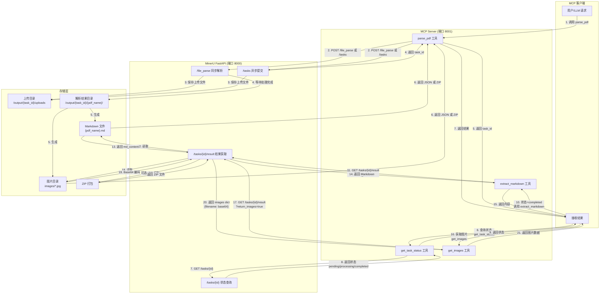

# MinerU MCP Server (Python)

一个基于 Python 的 Model Context Protocol (MCP) 服务器，与 MinerU 一体化部署在同一个容器中。

## 项目概述

本项目实现了一个 MCP 服务器，将 MinerU 的 PDF 解析能力通过 MCP 协议暴露给支持 MCP 的客户端（如 Claude Desktop、Cline 等）。

**核心优势**：
- **一体化部署**：MinerU + MCP 服务器在同一容器中，简化部署
- **零配置连接**：MCP 服务器直接调用本地 MinerU API，无需额外配置
- **两种运行模式**：支持 stdio（桌面客户端）和 HTTP（远程调用）模式

## 架构设计

```
┌─────────────────────────────────────────────────────────────┐
│                    All-in-One 容器                         │
│  ┌─────────────────────┐    ┌──────────────────────────┐   │
│  │   MinerU FastAPI    │    │    MCP Server (Python)   │   │
│  │   服务 (端口 8000)   │◄───│    stdio / HTTP 模式     │   │
│  │                     │    │                          │   │
│  │  - PDF 解析 API     │    │  - parse_pdf            │   │
│  │  - 任务管理         │    │  - get_task_status      │   │
│  │  - 结果下载         │    │  - extract_markdown     │   │
│  └─────────────────────┘    └──────────────────────────┘   │
│              内部 HTTP 调用 (localhost:8000)               │
└─────────────────────────────────────────────────────────────┘
```

## 文档处理流程



### 流程说明

#### 同步模式（`/file_parse`）

1. **上传文档**：客户端调用 `parse_pdf`，MCP Server 转发到 `/file_parse`
2. **等待处理**：MinerU 同步处理，客户端等待直到完成
3. **获取结果**：直接在响应中返回 Markdown 内容和图片（Base64）

#### 异步模式（`/tasks`）

1. **提交任务**：调用 `parse_pdf` 时指定 `async=true`，返回 `task_id`
2. **轮询状态**：使用 `get_task_status` 查询处理进度
3. **获取结果**：状态变为 `completed` 后，调用 `extract_markdown` 获取内容
4. **获取图片**：调用 `get_images` 获取提取的图片（Base64 格式）

#### 结果格式

**JSON 格式**：
```json
{
  "task_id": "uuid",
  "status": "completed",
  "results": {
    "document.pdf": {
      "md_content": "# 标题\n正文内容...",
      "images": {
        "page_1_img_0.jpg": "data:image/jpeg;base64,/9j/4AAQ...",
        "page_2_table_0.png": "data:image/png;base64,iVBORw..."
      }
    }
  }
}
```

**ZIP 格式**（设置 `response_format_zip=true`）：
```
document.pdf/
├── auto/
│   ├── document.md          # Markdown 文件
│   ├── document_middle.json # 中间结果
│   ├── images/              # 图片目录
│   │   ├── page_1_img_0.jpg
│   │   ├── page_2_table_0.png
│   └── document_origin.pdf  # 原始文件（可选）
```

## 功能特性

- **PDF 解析**：支持解析 PDF 文档，提取文本、图片、表格和公式
- **MCP 协议支持**：完全兼容 Model Context Protocol 标准
- **多种后端支持**：
  - `pipeline`：传统管道模式
  - `vlm-http-client`：远程 VLM 解析
  - `hybrid-http-client`：混合模式（本地 OCR + 远程 VLM）
  - `vlm-auto-engine`：本地 VLM 自动引擎
  - `hybrid-auto-engine`：本地混合管道
- **多语言支持**：中文、英文、日文、韩文等
- **公式识别**：支持数学公式识别
- **表格识别**：支持表格结构识别

## 快速开始

### 环境要求

- Docker（推荐）或 Python 3.10+
- MinerU 服务（一体化部署时已包含）

### 使用 Docker（推荐）

```bash
# 构建一体化镜像
docker build -t mineru-mcp-all-in-one:latest .

# 启动容器（stdio 模式）
docker run -d \
  --name mineru-mcp \
  -v $(pwd)/input:/input \
  -v $(pwd)/output:/output \
  --device /dev/kfd:/dev/kfd \
  --device /dev/dri:/dev/dri \
  -e MINERU_VLM_BASE_URL=http://your-vlm-server:8000/v1 \
  -e MINERU_VLM_API_KEY=your-api-key \
  mineru-mcp-all-in-one:latest

# 启动容器（HTTP 模式）
docker run -d \
  --name mineru-mcp \
  -p 3000:3000 \
  -p 8000:8000 \
  -e MCP_SERVER_MODE=http \
  -e MCP_HTTP_AUTH_TOKEN=your-secret-token \
  mineru-mcp-all-in-one:latest
```

### 本地开发

```bash
cd mcp-server
pip install -e .

# stdio 模式
python -m mcp_server

# HTTP 模式
python -m mcp_server --mode http --port 3000
```

## MCP 工具列表

### 1. `parse_pdf`

解析 PDF 文档并提取内容。

**参数：**
- `pdf_path` (string, required): PDF 文件路径
- `backend` (string, optional): 解析后端，默认 `hybrid-http-client`
- `lang` (string, optional): 文档语言，默认 `ch`
- `formula_enable` (boolean, optional): 启用公式识别，默认 `true`
- `table_enable` (boolean, optional): 启用表格识别，默认 `true`
- `server_url` (string, optional): VLM 服务器 URL

**示例：**
```json
{
  "pdf_path": "/input/document.pdf",
  "backend": "hybrid-http-client",
  "lang": "ch",
  "formula_enable": true,
  "table_enable": true
}
```

### 2. `get_task_status`

查询解析任务状态。

**参数：**
- `task_id` (string, required): 任务 ID

### 3. `extract_markdown`

从已解析的 PDF 中提取 Markdown 内容。

**参数：**
- `task_id` (string, required): 任务 ID

### 4. `list_supported_backends`

列出所有支持的解析后端。

## 与 MCP 客户端集成

### HTTP 模式调用

```bash
curl -X POST http://localhost:3000/mcp/invoke \
  -H "Authorization: Bearer your-secret-token" \
  -H "Content-Type: application/json" \
  -d '{
    "tool": "parse_pdf",
    "params": {
      "pdf_path": "/input/document.pdf",
      "backend": "hybrid-http-client"
    }
  }'
```

## 项目结构

```
mineru/
├── mcp-server/                 # MCP 服务器代码
│   ├── mcp_server/             # Python 包
│   │   ├── __init__.py
│   │   ├── __main__.py         # 入口点
│   │   ├── server.py           # MCP 服务器实现
│   │   ├── mineru_client.py    # MinerU API 客户端
│   │   ├── config.py           # 配置管理
│   │   └── tools/              # MCP 工具
│   │       ├── parse_pdf.py
│   │       ├── get_task_status.py
│   │       ├── extract_markdown.py
│   │       └── list_backends.py
│   ├── pyproject.toml
│   ├── requirements.txt
│   └── requirements-dev.txt
├── docs/                       # 文档
├── scripts/
│   └── start.sh                # 一体化启动脚本
├── Dockerfile                  # All-in-One 镜像
├── docker-compose.yml
└── .env.example
```

## 技术栈

**复用 MinerU 已有依赖**：
- `httpx` - HTTP 客户端（MinerU 已有）
- `loguru` - 日志系统（MinerU 已有）
- `click` - CLI 入口点（MinerU 已有）
- `fastapi` / `uvicorn` - HTTP 模式（MinerU 已有，可选）

**额外添加**：
- `mcp` - MCP Python SDK（官方）
- **配置管理**: `pydantic-settings`

## 开发指南

### 本地开发

```bash
# 安装开发依赖
pip install -e ".[dev]"

# 运行测试
pytest

# 代码格式化
black mcp_server/

# 类型检查
mypy mcp_server/
```

### 构建一体化镜像

```bash
docker build -t mineru-mcp-all-in-one:latest .
```

## 环境变量

### MCP Server 配置

| 变量名 | 说明 | 默认值 |
|--------|------|--------|
| `MCP_SERVER_MODE` | 运行模式 | `stdio` |
| `MCP_HTTP_PORT` | HTTP 端口 | `8001` |
| `MCP_HTTP_AUTH_TOKEN` | 认证令牌 | - |
| `LOG_LEVEL` | 日志级别 | `INFO` |

### MinerU 配置（用于 VLM 后端）

| 变量名 | 说明 |
|--------|------|
| `MINERU_VLM_BASE_URL` | VLM API 地址（如 OpenAI、阿里云） |
| `MINERU_VLM_API_KEY` | VLM API 密钥 |
| `MINERU_VLM_MODEL` | VLM 模型名称 |

**架构说明**：
- MCP Server 直接调用 MinerU 核心函数（`aio_do_parse`）
- VLM 配置通过 MinerU 配置文件 (`~/.mineru/mineru.json`) 传递

## 相关链接

- [MinerU 官方文档](https://mineru.readthedocs.io/)
- [MCP 协议规范](https://modelcontextprotocol.io/)
- [MCP Python SDK](https://github.com/modelcontextprotocol/python-sdk)

## 许可证

MIT License
